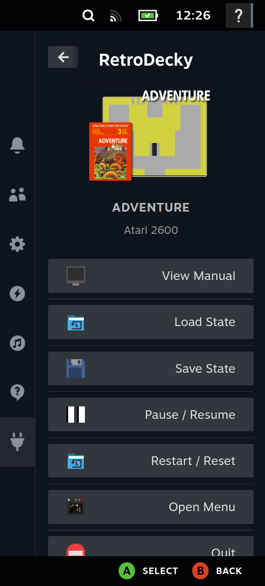

# RetroDecky
An Ingame Menu for RetroDeck as Decky Plugin. Allows to use emulator actions without using hotkeys.

## Goal of the plugin
RetroDeck supports multiple hotkeys to perform certain actions on the currently running emulator. Additionally RetroDeck supports standard Steam Input Menus. 
But there are certain problems with these approaches:
1. One has to remember multiple types of hotkeys across multiple emulators
2. Steam Input Menus do not provide a best user experience, especially when a lot of items have to be displayed

The goal of this plugin is to provide a menu which displays only the actions relevant for the currently opened game and provide an overall better menu user experience. Additionally the plugin supports certain actions which do no exist in RetroDeck right now, such as in game manual viewing.

## Features
- **Emulator Actions** - Displays actions specifically for the emulator
- **Action Triggering** - Triggering emulator actions via buttons instead of hotkeys  
- **PDF Manual Viewer** - View game manuals while staying in game
- **Game info** - View basic game info such as title, system and and an image

## Plugin Setup
1. You can install the Plugin in the following ways:
    1. Download the plugin from the **Decky Plugin Store** (Not available yet)
    2. Install the plugin from the **releases page**
    3. **Build the plugin yourself**
2. Ensure **RetroDeck Flatpak** is installed on your system
    1. Follow [this guide](https://retrodeck.readthedocs.io/en/latest/wiki_devices/steamdeck/steamdeck-start/) on how to install the RetroDECK Flatpak on your system
3. Open RetroDecky in the **Steam Quick Access Menu**
4. Follow the **Setup Guide** displayed in the plugin menu:
5. To reload the setup status, go to **Decky Settings > Plugins > RetroDecky > Reload**

## Known Issues
1. Hotkeys which require holding keys like Fast Forward are not correctly working yet
2. PDF Manual is currently more a proof of concept the aspect ratios and performance is not optimal

## How It Works
The plugin integrates with RetroDeck through ES-DE event scripts:

### Game Event Detection
1. When a game starts in RetroDeck, ES-DE executes a custom event script
    1. This script is injected into the ES-DE scirpts folder of RetroDeck when the plugin starts
2. The script sends game information to the plugin's backend server
3. The plugin receives the game event and displays it in the menu
4. Actions are filtered based on the current game's system and emulator

### Media Resolution
1. The plugin automatically resolves game cover art and manual paths from ES-DE's media directories
2. It checks for miximages, covers, and manuals in the appropriate system folders
3. Media is served through a local HTTP server for display in the plugin

### Action triggering
1. This plugins supports most hotkeys which are listed here as actions: https://retrodeck.readthedocs.io/en/latest/wiki_rd_controls/radial-steamdeck-full/
2. A script converts those hotkey mappings into an action json file which contains all mappings for each emulator
3. The full mappings can be seen in [this autogenerated filed](./defaults/presets/actions_summary.md)
4. When triggering an action via the menu, the plugin than presses the keyboard combination of the action on the currently running emulator

### Game manual displaying
1. The game manuals are just PDFs which are rendered via PDF.js
2. This approach acts currently more as a proof of concept

## Acknowledgements
1. RetroDeck Logo, Icons and certain config files are taken from the RetroDeck project: https://github.com/RetroDECK/RetroDECK
2. Release workflow taken from https://github.com/aarron-lee/SimpleDeckyTDP/blob/main/.github/workflows/release.yml
