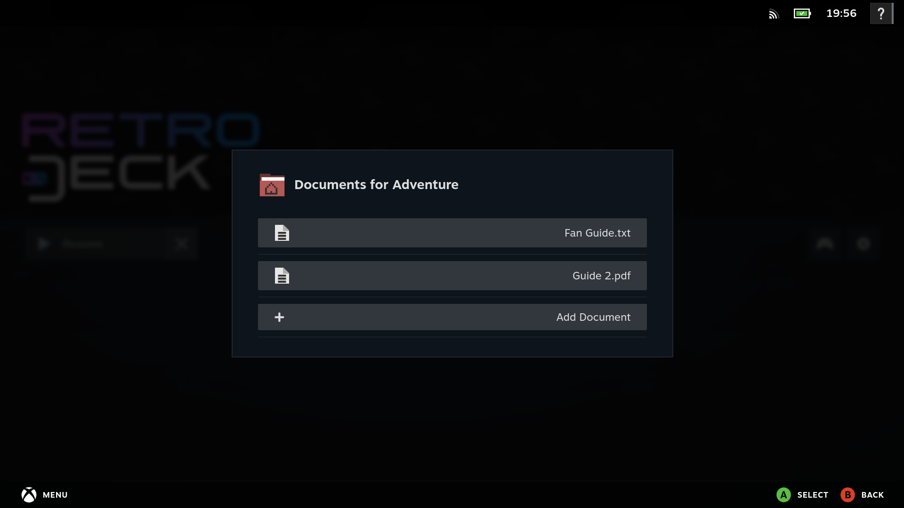
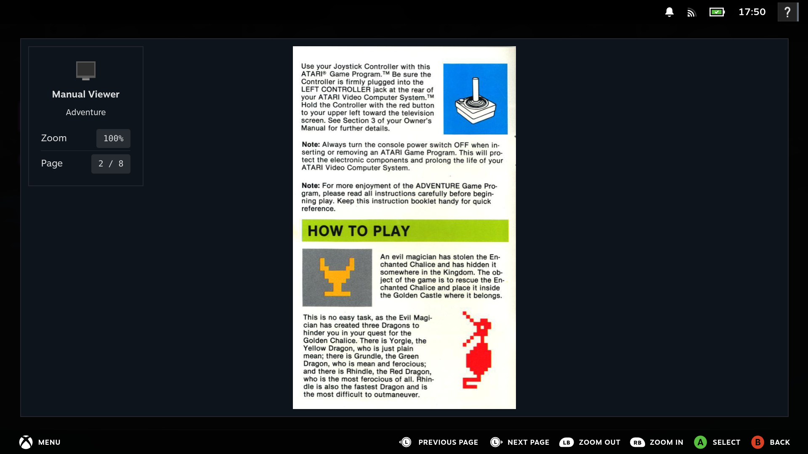
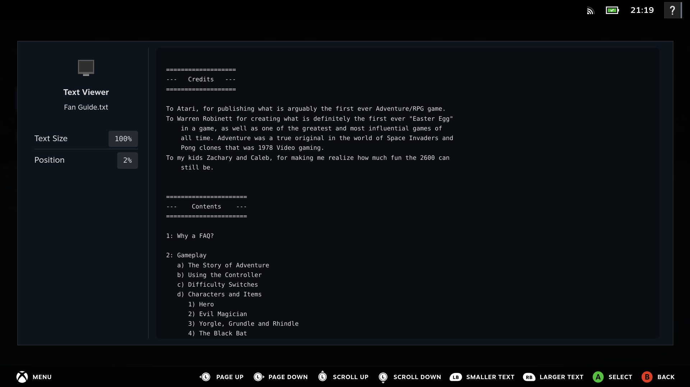
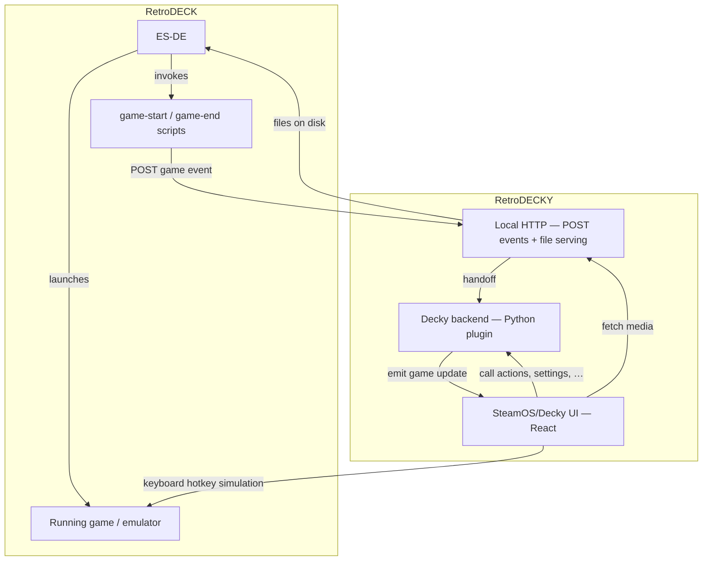

# RetroDECKY

<p>
  
</p>


**RetroDECKY** is a Decky Plugin for the all-in-on Retro Gaming Platform [RetroDECK](https://retrodeck.readthedocs.io/en/latest/). 

## Screenshots

<p>
  
  
  
</p>

<p>
  
  
</p>

<p>
  
  
</p>

---

## Purpose and Goal of RetroDECKY

RetroDECK provides multiple built-in **hotkey combinations** for interacting with the currently running component. It also supports **Steam Deck system hotkeys** and **Steam Input templates** that feature multitude of radial button submenus.

That approach present usability challenges:

- Users must remember multiple hotkey schemes across different components.
- Steam Input menus provide limited usability when displaying many actions.

RetroDECKY addresses these issues by providing a **content-aware** in-game menu that:

- Displays only actions relevant to the currently running component.
- Improves usability compared to large radial or input menus.
- Expands features not currently available or possible in RetroDECK (but might be in the future) like an in game manual viewer.

---

## Features

- **Running Game Actions** - Displays hotkey actions specific to the currently running game.

- **Running Game Information** - Displays data from ES-DE such as artwork, covers and metadata.

- **Hotkey Triggering** - Execute hotkey functions through Decky menu buttons instead of keyboard hotkeys, button combos or radial menus.

- **Boot into RetroDECK** - A function to automatically start RetroDECK when Steam launches in Game Mode.

- **PDF Manual Viewer** - Read game manuals without leaving the game session.

- **Additional Documents** - Add PDF, TXT, or Markdown documents per game and view them during the game session

---

## Known Issues

- Hotkey actions requiring **held inputs** like fast-forward are not fully supported.
- The **PDF manual viewer** is currently experimental.
- Launching games directly via the Steam library is currently not supported.

---

## Requirements for RetroDECKY: Decky Loader & RetroDECK

Before you can install **RetroDECKY** ensure the following are installed:

### Install RetroDECK


RetroDECK must be installed before using the plugin.

- [RetroDECK Installation Guide](https://retrodeck.readthedocs.io/en/latest/wiki_general/retrodeck-start/)

Read the **Steam Deck** installation section.

### Install Decky Loader


Decky Loader is required to run the RetroDECKY plugin.

- [Decky Loader Website](https://decky.xyz/)
- [Decky Loader GitHub](https://github.com/SteamDeckHomebrew/decky-loader/)

---

## How-to Install RetroDECKY

### Step 1: Install the Plugin

Choose one of the following methods:

- Install from the **Decky Plugin Store** *(not available yet, but will be the recommended path)* 
- Download and install from the **GitHub Releases page**
  1. Switch to desktop mode and open your browser
  2. Go to the [GitHub Releases page](https://github.com/Teppichseite/RetroDECKY/releases)
  3. For the latest release download `RetroDECKY.zip` under assets
  4. Switch back to Gaming mode
  5. Open the Quick Access Menu > Decky Tab > Click on the settings icon on the top right
  6. Under "General" enable "Developer mode"
  7. Go to the "Developer" section on the left side
  8. Click on "Browse" next to "Install Plugin from ZIP file"
  9. Select the `RetroDECKY.zip` file you downloaded in step 3 (usually stored under `~/Downloads`)
  10. Click on "Install"
---

### Step 2: Launch the Plugin

1. Open the **Steam Quick Access Menu**.
2. Launch **RetroDECKY**.
3. Follow the **Setup Guide** shown in the plugin interface.
4. Reload Setup Status (if needed): Decky Settings → Plugins → RetroDECKY → Reload

---

## Architecture: How does it work?

RetroDECKY sits between **ES-DE / RetroDECK** (which runs games and fires event scripts) and the **SteamOS** UI.

- **Local HTTP service** — Receives game lifecycle **POSTs** from ES-DE scripts and **serves** ES-DE media and custom documents so the **React** menu can load covers and manuals in the browser.

- **Decky backend** — The plugin’s Python side that **Decky Loader** talks to: the UI **calls into** it for actions, settings, setup checks, and document lists (the usual Decky plugin channel, separate from the localhost HTTP service above).

- **Event emission** — When a game event POST is handled, the backend **emits** an update through Decky so the menu **refreshes immediately** instead of polling for the active game.

The **React** frontend loads media data from the local service, uses the **Decky backend** for structured data, and can send **simulated keyboard shortcuts** to the active emulator or component.



### Game Event Detection

RetroDECKY uses [ES-DE custom event scripts](https://github.com/RetroDECK/ES-DE/blob/retrodeck-main/INSTALL.md#custom-event-scripts). The **game-start** and **game-end** events notify the plugin when a session begins and ends so the menu can show the right game context and metadata.

Scripts live under:

```
/home/deck/.var/app/net.retrodeck.retrodeck/config/ES-DE/scripts
├── game-end
│   └── game_end_RetroDECKY_v1.sh
└── game-start
    └── game_start_RetroDECKY_v1.sh
```

Each script sends a small background HTTP **POST** request to RetroDECKY’s local **`/api/game-event`** endpoint: one payload marks a **game start**, the other a **game end**, and both include the same four pieces of information ES-DE passes in: **ROM path**, **game name**, **system name**, and **system full name**. That lets the plugin know which game is currently running.

#### Detected ES-DE Metadata

The plugin automatically resolves assets using **ES-DE** metadata directories under `${retrodeck_home_path}$/ES-DE/` and under `${retrodeck_downloaded_media_path}$`.

Supported media types include:

- **Gamelists**
- **Cover artwork**
- **Miximages**
- **Game manuals**

Metadata and assets are served through the **local HTTP** layer above and shown in the **Decky** UI.

---

### Hotkey Triggering

RetroDECKY supports most component hotkeys documented here: 

[RetroDECK Hotkeys](https://retrodeck.readthedocs.io/en/latest/wiki_rd_controls/radial-steamdeck-full/)  

- A script converts hotkey definitions into an **action mapping JSON file** per component.

- Full mappings are documented in the autogenerated file: [actions_summary.md](./defaults/presets/actions_summary.md)

- When a user selects an action from the menu, the plugin simulates the corresponding **keyboard input combination** for the active component.

---

### Game PDF Viewer

The plugin uses PDF.js and react-pdf to render PDF files. Internally it uses WASM to improve rendering performance.

---

## Acknowledgements

- RetroDECK assets, art and configuration files originate from the RetroDECK project.
  - [GitHub: RetroDECK](https://github.com/RetroDECK/RetroDECK)
  - Corresponding licenses check `LICENSE`.

<br>

- The release workflow is based on SimpleDeckyTDP's workflow.
  - [GitHub: SimpleDeckyTDP - Workflow ](https://github.com/aarron-lee/SimpleDeckyTDP/blob/main/.github/workflows/release.yml)

---
