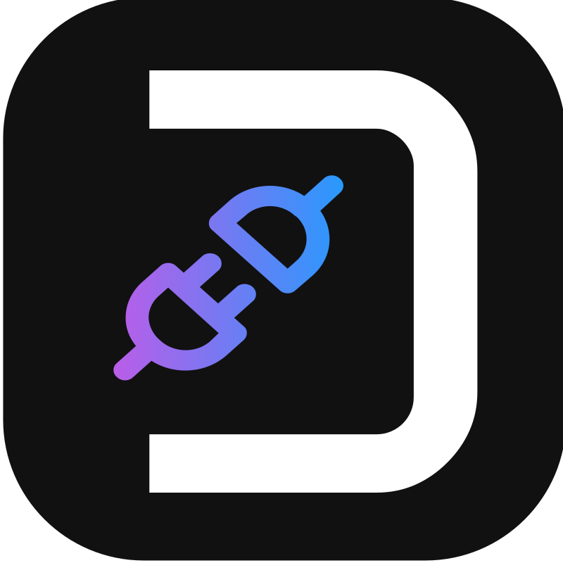
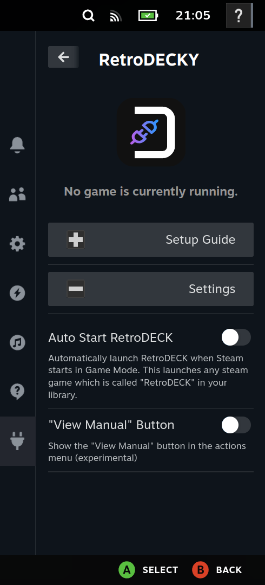
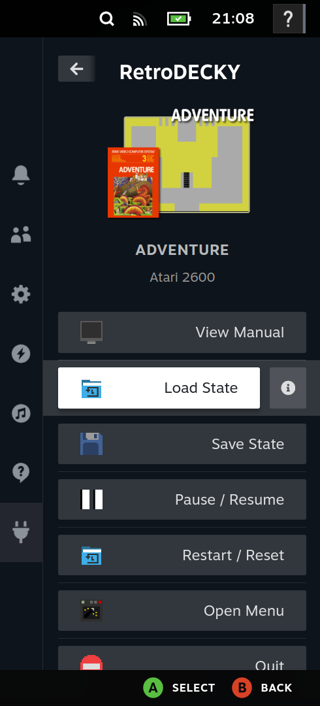
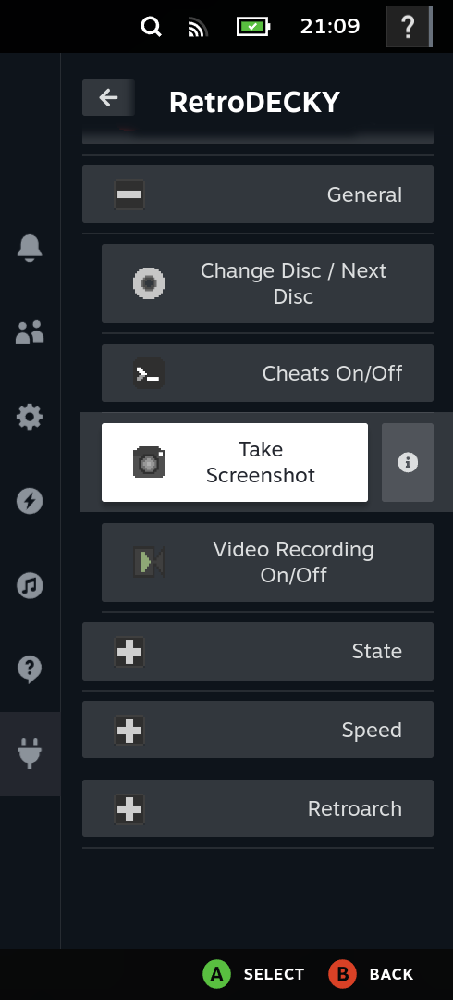
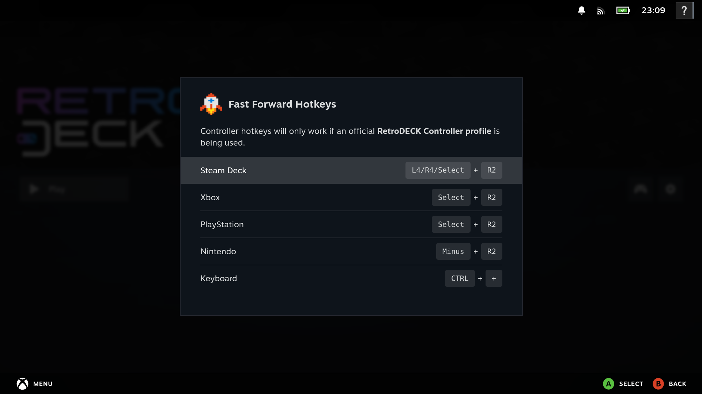

# RetroDECKY

  

**RetroDECKY** is a Decky Plugin for the all-in-on Retro Gaming Platform [RetroDECK](https://retrodeck.readthedocs.io/en/latest/). 

## Screenshots

  
  
  

  

---

## Purpose and Goal of RetroDECKY

RetroDECK provides multiple built-in **hotkey combinations** for interacting with the currently running component. It also supports **Steam Deck system hotkeys** and **Steam Input templates** that feature multitude of radial button submenus.

That approach present usability challenges:

- Users must remember multiple hotkey schemes across different components.
- Steam Input menus provide limited usability when displaying many actions.

RetroDECKY addresses these issues by providing a **content-aware** in-game menu that:

- Displays only actions relevant to the currently running component.
- Improves usability compared to large radial or input menus.
- Expands features not currently available or possible in RetroDECK (but might be in the future) like an in game manual viewer.

---

## Features

- **Component Hotkey Information** - Displays hotkey actions specific to the currently running component.

- **RetroDECKY Hotkey Triggering** - Execute hotkey functions through Decky menu buttons instead of keyboard hotkeys, button combos or radial menus.

- **Boot into RetroDECK** - A function to automatically start RetroDECK when Steam launches in Game Mode.

- **PDF Manual Viewer** - Read game manuals without leaving the game session.

- **Game Information** - Displays basic metadata such as game title, system, and cover image.

---

## Known Issues

- Hotkey actions requiring **held inputs** like fast-forward are not fully supported.
- The **PDF manual viewer** is currently experimental.

---

## Requirements for RetroDECKY: Decky Loader & RetroDECK

Before you can install **RetroDECKY** ensure the following are installed:

### Install RetroDECK

RetroDECK must be installed before using the plugin.

- [RetroDECK Installation Guide](https://retrodeck.readthedocs.io/en/latest/wiki_general/retrodeck-start/)

Read the **Steam Deck** installation section.

### Install Decky Loader

Decky Loader is required to run the RetroDECKY plugin.

- [Decky Loader Website](https://decky.xyz/)
- [Decky Loader GitHub](https://github.com/SteamDeckHomebrew/decky-loader/)

---

## How-to Install RetroDECKY

### Step 1: Install the Plugin

Choose one of the following methods:

- Install from the **Decky Plugin Store** *(not available yet, but will be the recommended path)* 
- Download and install from the **GitHub Releases page**.

---

### Step 2: Launch the Plugin

1. Open the **Steam Quick Access Menu**.
2. Launch **RetroDECKY**.
3. Follow the **Setup Guide** shown in the plugin interface.
4. Reload Setup Status (if needed): Decky Settings → Plugins → RetroDECKY → Reload

---

## Architecture: How does it work?

**RetroDECKY** integrates with RetroDECK using through ES-DE event scripts.

### Game Event Detection

1. When a game launches in RetroDECK via the **ES-DE** component, a custom event script is executed. RetroDECKY injects this script via `retrodeck/ES-DE/custom_systems/` directory during initialization.
2. The script sends the games metadata and assets to the plugin backend.
3. The plugin updates the menu with metadata and assets based on the detected game in combination with what system.

#### Detected ES-DE Metadata

The plugin automatically resolves assets using **ES-DE** metadata directories under `retrodeck/ES-DE/`.

Supported media types include:

- **Cover artwork**
- **Gamelists**
- **Game manuals**
- **Miximages**

Metadata and assets served through a **local HTTP server** and displayed within the plugin interface.

---

### Hotkey Triggering

RetroDECKY supports most component hotkeys documented here: 

[RetroDECK Hotkeys](https://retrodeck.readthedocs.io/en/latest/wiki_rd_controls/radial-steamdeck-full/)  

- A script converts hotkey definitions into an **action mapping JSON file** per component.

- Full mappings are documented in the autogenerated file: [actions_summary.md](./defaults/presets/actions_summary.md)

- When a user selects an action from the menu, the plugin simulates the corresponding **keyboard input combination** for the active component.

---

### Game Manual Viewer

Current implementation is a **proof of concept**.

- Game manuals are stored as **PDF files**.
- Rendering is handled using **PDF.js**.

---

## Acknowledgements

- RetroDECK assets, art and configuration files originate from the RetroDECK project.
  - [GitHub: RetroDECK](https://github.com/RetroDECK/RetroDECK)
  - Corresponding licenses check `other_licenses.txt`.

 

- The release workflow is based on SimpleDeckyTDP's workflow.
  - [GitHub: SimpleDeckyTDP - Workflow ](https://github.com/aarron-lee/SimpleDeckyTDP/blob/main/.github/workflows/release.y)

---
