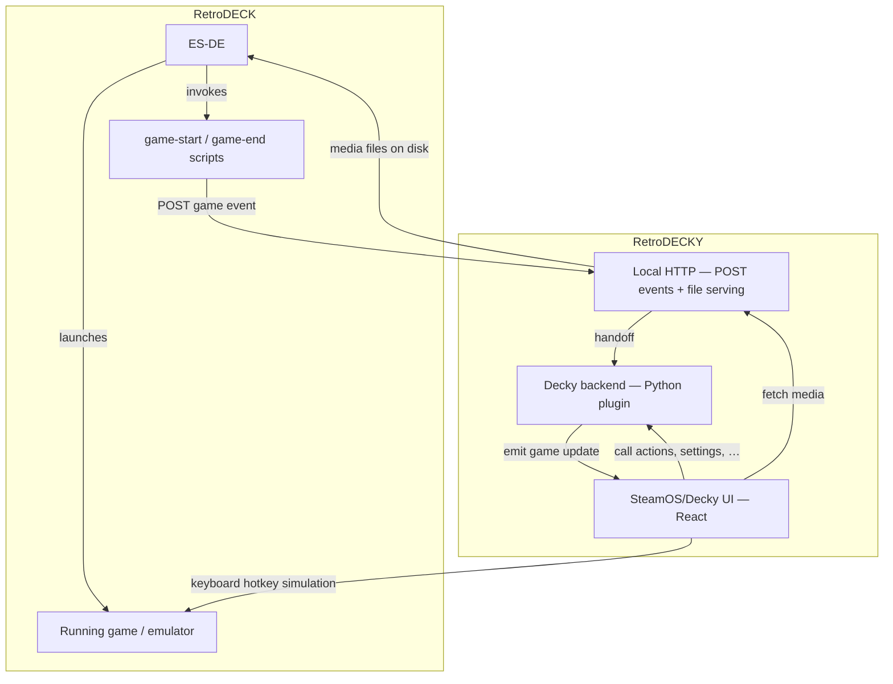

```mermaid
flowchart TB
    subgraph retrodeck["RetroDECK"]
        ES["ES-DE"]
        Game["Running game / emulator"]
        Scripts["game-start / game-end scripts"]
    end

    subgraph plugin["RetroDECKY"]
        UI["SteamOS/Decky UI — React"]
        HTTP["Local HTTP — POST events + file serving"]
        BE["Decky backend — Python plugin"]
    end

    ES -->|"launches"| Game
    ES -->|"invokes"| Scripts
    Scripts -->|"POST game event"| HTTP
    HTTP -->|"handoff"| BE
    BE -->|"emit game update"| UI
    UI -->|"call actions, settings, …"| BE
    UI -->|"fetch media"| HTTP
    HTTP -->|"media files on disk"| ES
    UI -->|"keyboard hotkey simulation"| Game
```
